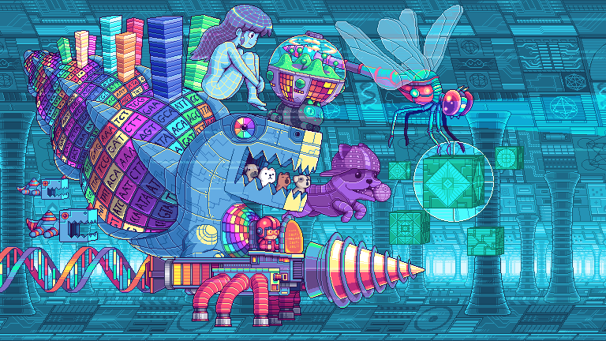

```shell

  ██╗    ██╗███████╗     █████╗ ██████╗ ███████╗    ██╗   ██╗ ██████╗ ██████╗ ████████╗███████╗██╗  ██╗
  ██║    ██║██╔════╝    ██╔══██╗██╔══██╗██╔════╝    ██║   ██║██╔═══██╗██╔══██╗╚══██╔══╝██╔════╝╚██╗██╔╝
  ██║ █╗ ██║█████╗      ███████║██████╔╝█████╗      ██║   ██║██║   ██║██████╔╝   ██║   █████╗   ╚███╔╝
  ██║███╗██║██╔══╝      ██╔══██║██╔══██╗██╔══╝      ╚██╗ ██╔╝██║   ██║██╔══██╗   ██║   ██╔══╝   ██╔██╗
  ╚███╔███╔╝███████╗    ██║  ██║██║  ██║███████╗     ╚████╔╝ ╚██████╔╝██║  ██║   ██║   ███████╗██╔╝ ██╗
   ╚══╝╚══╝ ╚══════╝    ╚═╝  ╚═╝╚═╝  ╚═╝╚══════╝      ╚═══╝   ╚═════╝ ╚═╝  ╚═╝   ╚═╝   ╚══════╝╚═╝  ╚═╝

```
[](https://www.last.fm/user/zero-vortex)

### 📱 Social links

- Polywork: [vortex](https://vortex.name)
- Twitter: [0_vortex](https://twitter.com/0_vortex)
- Stalker: [connect-with.vortex.name](https://connect-with.vortex.name)

### 🔮 Start a conversation

- Psychology: [commander](https://www.16personalities.com/profiles/bdbc4d20d6087)
- Email: [ted.vortex@gmail.com](mailto:ted.vortex@gmail.com?subject=Contact%20Request)
- Phone: [754-345-624](sms:+40754345624)

### 🔐 Machines only section


<details open>
  <summary>Quote of the day</summary>

<!--STARTS_HERE_QUOTE_README-->
<i>❝Hard disks are so sensitive to vibration, that just screaming at them diminishes their performance.❞</i>
<!--ENDS_HERE_QUOTE_README-->

</details>

<details>
  <summary>GitHub Actions</summary>

[](https://github.com/0-vortex/0-vortex/actions/workflows/config.yml)

[](https://github.com/0-vortex/0-vortex/actions/workflows/quote.yml)

[](https://github.com/0-vortex/0-vortex/actions/workflows/metrics.yml)

</details>

<details>
  <summary>Hard facts about life</summary>

> 4e6f7420656e6c69676874656e65642c206a7573742062726f6b656e2e
>
> 48617070696e657373206973207265616c69747920776974686f7574206578706563746174696f6e2e
>
> 4275742074686572652773207374696c6c206e6f207265737420666f7220746865207769636b65642e

</details>

<details>
  <summary>Memes</summary>


</details>

### :octocat: GitHub Activity


